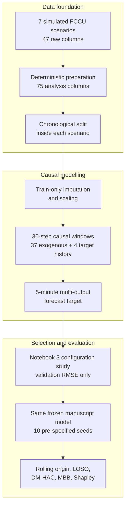
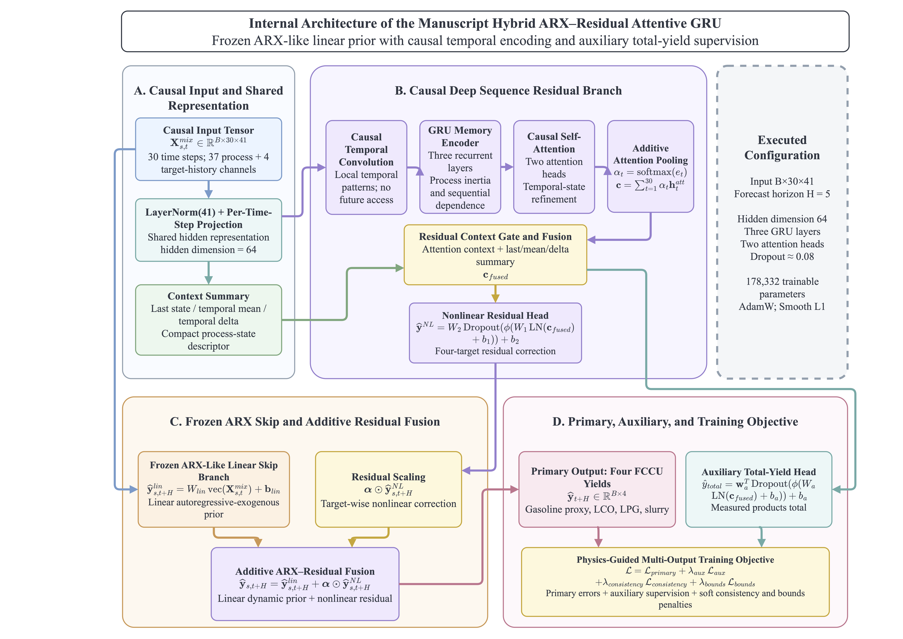
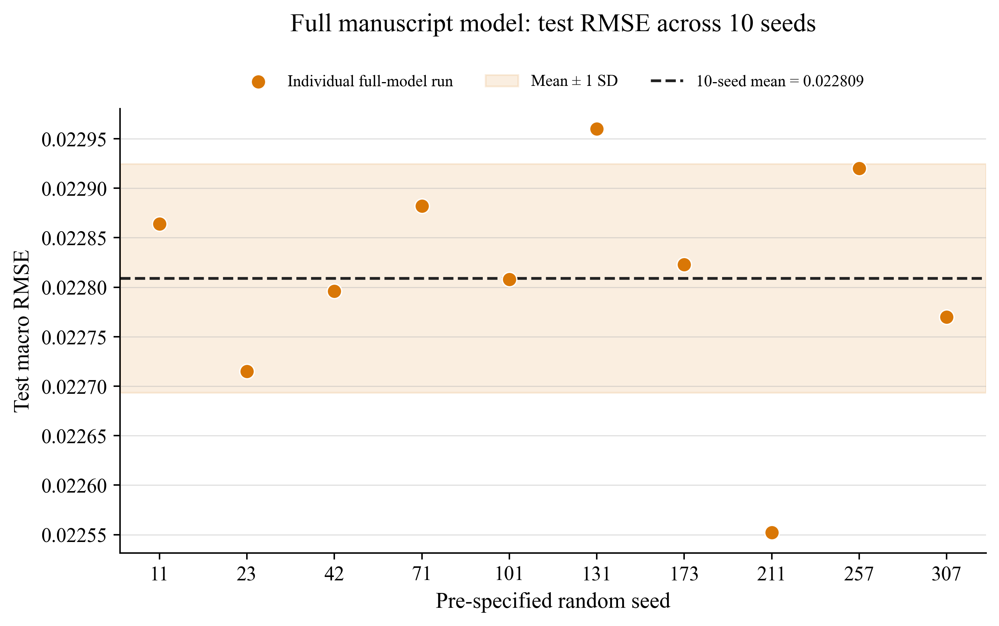
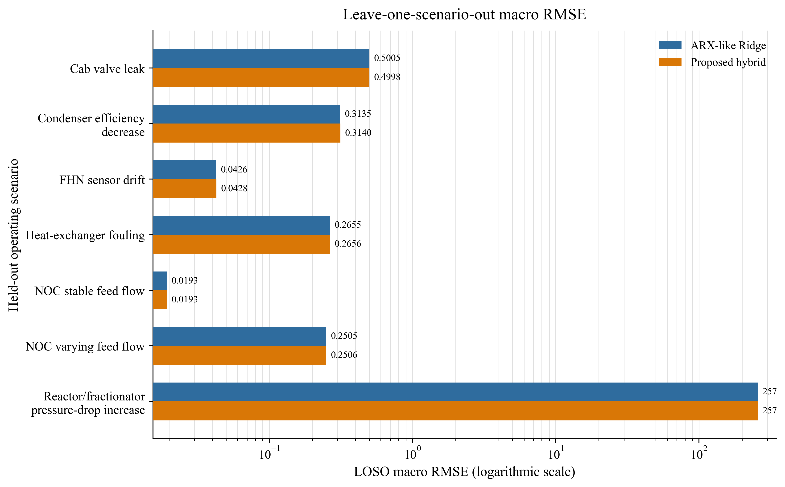
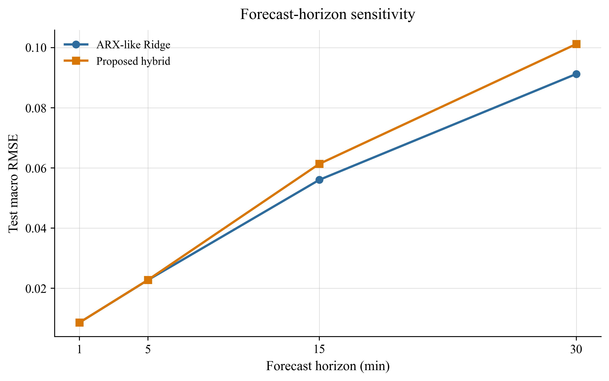
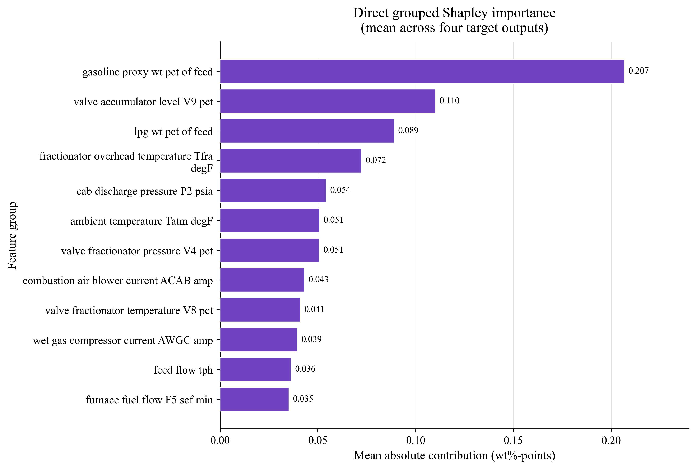

# Process-Informed Hybrid ARX–Residual Attentive GRU for FCCU Product-Yield Forecasting

[](https://www.python.org/)
[](https://jupyter.org/)
[](https://pytorch.org/)
[](https://github.com/ML-PSE/Fluid-Catalytic-Cracking-Unit-Dataset-for-Process-Monitoring-Evaluation)

This repository provides the executed research workflow for short-horizon,
multi-output forecasting of fluid catalytic cracking unit (FCCU) product-yield
proxies. The proposed model is the **manuscript Hybrid ARX–Residual Attentive
GRU**: a frozen ARX-like linear prior combined with a causal temporal
convolution, a three-layer GRU, causal self-attention, additive attention
pooling, residual context gating, a nonlinear residual head, and auxiliary
total-yield supervision.

The repository preserves the proposed architecture reported in the manuscript;
no replacement or compact substitute model is introduced. Notebook 3 records
the validation-only configuration study used during model development, while
Notebook 4 contains the frozen-architecture reviewer-response experiments:
multi-seed, dependence-aware, rolling-origin, leave-one-scenario-out,
multi-horizon, residual-comparator, and direct grouped Shapley analyses.

> **Evidence boundary.** The FCCU benchmark is simulated rather than plant
> measurement data. The historical test subset was not used for architecture,
> hyperparameter, checkpoint, residual-scaling, or random-seed selection. Model
> development decisions used the training and validation subsets; the
> historical test subset was used only for final evaluation after the protocol
> was fixed. No statistically significant overall advantage over ARX-like
> Ridge is claimed.

## Manuscript and reviewer-response result boundary

The manuscript's `RMSE = 0.0224`, `MAE = 0.0172`, and `R² = 0.9679` describe
the original validation-selected single run reported by Notebook 3. They are
retained only as the initial manuscript result and are not the primary revised
estimate. The reviewer-response conclusions use the same, unchanged proposed
architecture across ten pre-specified seeds: historical-test RMSE
`0.022809 ± 0.000116`, MAE `0.017378 ± 0.000081`, and R²
`0.967491 ± 0.000344`. ARX-like Ridge achieves RMSE `0.022751`; the available
statistical tests do not identify a significant difference between the two
models. This distinction reconciles the original manuscript tables with the
additional reviewer-response evidence without redefining the proposed model.

## Dataset and source

The analysis is derived from the open **Fluid Catalytic Cracking Unit Dataset
for Process Monitoring Evaluation**:

- [Official ML-PSE dataset repository](https://github.com/ML-PSE/Fluid-Catalytic-Cracking-Unit-Dataset-for-Process-Monitoring-Evaluation)
- [Dataset description page](https://mlforpse.com/fccu-dataset/)
- [Underlying open FCCU simulation model](https://github.com/Baldea-Group/FCC-Fractionator)
- [Source-model article](https://doi.org/10.1016/j.compchemeng.2022.107900)

The seven retained scenarios contain 20,160 one-minute observations. Within
each scenario, samples are ordered chronologically and assigned to train,
validation, and historical-test segments.

| Data stage | Added columns | Total | Forecasting role |
| --- | ---: | ---: | --- |
| Raw scenario CSV | 47 | 47 | `time_min` plus 46 source signals |
| Scenario and split metadata | 16 | 63 | Audit and partition control; excluded from predictors |
| Deterministic units, aggregates, and yield proxies | 12 | 75 | Analysis-ready dataset |
| Causal model tensor | — | 41 | 37 exogenous channels + 4 lagged target channels |

The four forecast targets are gasoline proxy, light cycle oil, LPG, and slurry,
all expressed as wt% of feed. `measured_products_wt_pct_of_feed` is used as an
auxiliary total-yield target, not as an additional forecast output.

## Leakage-safe workflow



Preprocessing is fitted on training data only. Future targets, scenario labels,
fault labels, split identifiers, and fault-timing metadata never enter the
predictor. Window construction is performed separately within each scenario
and split, preventing lookback windows from crossing partition boundaries.

## Proposed architecture



*Terminology note:* the supplied manuscript artwork retains the legacy block
label “Physics-Guided Multi-Output Training Objective.” In the reviewer-response
terminology, this unchanged block is named **Consistency-Regularized
Multi-Output Training Objective**. It denotes auxiliary total-yield consistency
and soft admissible-range penalties, not independent physical supervision or a
first-principles FCC model.

| Component | Executed configuration |
| --- | --- |
| Input | `B × 30 × 41` causal tensor |
| Forecast horizon | 5 minutes |
| Linear prior | Frozen target-wise ARX-like Ridge skip branch |
| Local temporal encoder | Causal temporal convolution |
| Process memory | Three GRU layers, hidden dimension 64 |
| Temporal weighting | Two-head causal self-attention + additive attention pooling |
| Nonlinear correction | Residual context gate and four-target residual head |
| Auxiliary objective | Total-yield head with consistency and soft bounds regularization |
| Optimizer | AdamW; Smooth L1 primary loss |
| Parameters | 178,332 trainable; 4,924 frozen ARX; 183,256 total |

The term *process-informed* denotes the causal ARX prior, auxiliary total-yield
consistency, and soft admissible-range penalties. It does not imply direct
first-principles supervision or a hard physical projection.

## Configuration provenance and reviewer-closure boundary

Notebook 3 contains a ten-trial Optuna study evaluated exclusively by validation
macro RMSE; a median pruner used three startup trials. This is the documented
model-development record, not a new reviewer-closure search. The resulting
configuration matches the manuscript architecture and was frozen before the
additional experiments in Notebook 4. No architecture, loss weight,
checkpoint, or random seed was selected from historical-test performance, and
Notebook 4 performs no new hyperparameter search.

| Parameter | Executed search space | Selected |
| --- | --- | ---: |
| Hidden dimension | {64, 96, 128} | 64 |
| Attention heads | {2, 4, 8}, divisible by hidden dimension | 2 |
| GRU layers | {1, 2, 3} | 3 |
| Dropout | [0.05, 0.20] | 0.079951 ≈ 0.08 |
| Learning rate | [0.001, 0.004], log scale | 0.002040 |
| Weight decay | [1e-6, 5e-4], log scale | 0.000040 |
| Batch size | {64, 128} | 128 |
| Auxiliary-loss weight | [0.10, 0.35] | 0.142631 |
| Consistency weight | [0.05, 0.30] | 0.066263 |
| Bounds weight | [0.005, 0.05], log scale | 0.044448 |

These values are the fixed configuration used in the manuscript model and the
reviewer-response experiments; global optimality is not claimed.

The validation-only study recorded a best validation macro RMSE of `0.020483`
in Notebook 3. This value is a configuration-development result, not the
ten-seed reviewer-response estimate. Notebook 4 evaluates the same frozen
configuration across the pre-specified seeds 11, 23, 42, 71, 101, 131, 173,
211, 257, and 307.

## Main frozen-model results

| Model / split | RMSE | MAE | R² | sMAPE (%) |
| --- | ---: | ---: | ---: | ---: |
| Proposed, validation, 10-seed mean ± SD | 0.020590 ± 0.000061 | 0.016140 ± 0.000052 | 0.985095 ± 0.000081 | 0.133122 ± 0.000374 |
| Proposed, historical test, 10-seed mean ± SD | 0.022809 ± 0.000116 | 0.017378 ± 0.000081 | 0.967491 ± 0.000344 | 0.134715 ± 0.000557 |
| ARX-like Ridge, historical test | 0.022751 | 0.017394 | 0.967819 | 0.134932 |

The point estimates are nearly identical. The available dependence-aware tests
do not establish a statistically significant overall advantage of the proposed
model over ARX-like Ridge.



## Dependence-aware inference

For the primary frozen run (seed 42), the window-level squared-loss difference
is defined as proposed minus ARX. Serial dependence is handled within each
scenario.

| Test | Estimate / statistic | Result |
| --- | --- | --- |
| Scenario-paired Wilcoxon | statistic 13.0 | two-sided p = 0.9375 |
| Diebold–Mariano with HAC variance | mean difference 4.895586e-7; DM = 0.049800; HAC lag 34 | two-sided p = 0.960282 |
| Overlapping moving-block bootstrap | 5,000 repetitions; block length 35 | 95% CI [-2.3e-5, 1.1e-5] |

The moving-block bootstrap resamples overlapping sequential blocks within each
scenario and then gives every scenario equal weight. Its interval contains
zero, consistent with the non-significant seed-42 DM-HAC and Wilcoxon results.
Seed-specific DM-HAC values are retained in
[`dm_hac_by_seed.csv`](artifacts/reviewer_closure/dm_hac_by_seed.csv).

## Rolling-origin evaluation

Rolling-origin assessment uses only the original development portion
(`train + validation`); historical-test rows used = 0. Fractions are applied
within each scenario, so exact minute cutoffs differ with scenario length and
are published in
[`rolling_origin_cutoffs.csv`](artifacts/reviewer_closure/rolling_origin_cutoffs.csv).

| Origin | Train / validation / assessment | Windows (train / validation / assessment) | Proposed RMSE | ARX RMSE |
| ---: | --- | --- | ---: | ---: |
| 1 | 40% / 15% / 15% | 6,613 / 2,329 / 2,329 | 0.040070 | 0.040109 |
| 2 | 55% / 15% / 15% | 9,185 / 2,329 / 2,329 | 0.021406 | 0.021417 |
| 3 | 70% / 15% / 15% | 11,752 / 2,329 / 2,329 | 0.021766 | 0.021815 |

The three-origin mean macro RMSE is 0.027747 for the proposed model and
0.027780 for ARX-like Ridge. These results support temporal stability on the
development trajectories, not superiority.

## Scenario and horizon stress tests

Leave-one-scenario-out evaluation does **not** confirm robust generalization to
an unseen operating regime. The equal-scenario macro average is 36.954216 for
the proposed model and 36.954174 for ARX-like Ridge, dominated by the held-out
reactor/fractionator pressure-drop-increase scenario.



The seed-42 horizon experiment shows that the proposed model remains close to
ARX at 1–5 minutes, whereas ARX is better at 15 and 30 minutes.

| Horizon | Proposed RMSE | ARX RMSE |
| ---: | ---: | ---: |
| 1 min | 0.008602 | 0.008608 |
| 5 min | 0.022796 | 0.022751 |
| 15 min | 0.061341 | 0.056038 |
| 30 min | 0.101168 | 0.091227 |



Accordingly, the supported forecasting scope is short-horizon operation,
especially 1–5 minutes; a broad long-horizon advantage is not claimed.

## Direct model interpretation

The primary interpretation calls the frozen proposed model directly. Grouped
permutation-Shapley values were estimated for 41 input-channel groups using 28
scenario-stratified windows and 64 permutations organized as 32 antithetic
pairs. The target-mean ranking is led by the historical gasoline channel
(approximately 0.207 wt%-points), accumulator-level valve V9 (0.110), the
historical LPG channel (0.089), fractionator overhead temperature (0.072), and
CAB discharge pressure P2 (0.054).



Random-Forest TreeSHAP figures in the exploratory workflow describe
feature–target associations and are not presented as direct explanations of
the neural hybrid. A separate surrogate audit produced fidelity R² values of
0.989549, 0.668737, 0.995762, and 0.805008 for gasoline, LCO, LPG, and slurry,
respectively. Fidelity is insufficient for LCO and slurry; therefore the
surrogate was not used for the principal Shapley conclusions.

## Computational profile

| Measure | Proposed hybrid | ARX-like Ridge |
| --- | ---: | ---: |
| Parameters | 183,256 total / 178,332 trainable | 4,924 |
| End-to-end training time | 89.969 s | 34.394 s |
| Single-window median latency | 15.221 ms | 0.0248 ms |
| Single-window p95 latency | 17.645 ms | 0.0314 ms |
| 256-window median latency | 20.358 ms | 0.291 ms |
| 256-window throughput | 12,575 windows/s | 879,916 windows/s |

Timing values use the unified reviewer-response protocol. Earlier Notebook 3
latency fields were produced under a different measurement boundary and must
not be compared directly with these values. Under the matched protocol, the
median single-window latency is `15.221 ms` for the proposed model and
`0.0248 ms` for ARX-like Ridge. ARX-like Ridge is therefore preferable when
minimal latency, simplicity, and comparable short-horizon accuracy are the
primary deployment criteria.

## Repository structure

```text
.
├── DATASET_CONTEXT/          # source provenance, dictionary, targets, loader, preparation code
├── notebooks/                # four executed Jupyter notebooks
├── artifacts/
│   └── reviewer_closure/     # compact reviewer-facing CSV tables
├── figures/                  # manuscript Figures 1–11 and supplementary reviewer figures
├── FCCU_DYNAMIC_NN_DATASET.csv
├── requirements.txt
└── README.md
```

| Notebook | Purpose |
| --- | --- |
| [`FCCU_01`](notebooks/FCCU_01_Data_Audit_and_Journal_Analysis.ipynb) | Provenance, 75-column audit, targets, leakage checks, and exploratory figures |
| [`FCCU_02`](notebooks/FCCU_02_ML_Journal_Workflow.ipynb) | Classical ML and ARX-like baselines |
| [`FCCU_03`](notebooks/FCCU_03_DL_SOTA_Proposed_Journal_Workflow.ipynb) | Sequence baselines, the manuscript architecture, and its validation-only configuration study |
| [`FCCU_04`](notebooks/FCCU_04_Integrated_Results_Journal_Workflow.ipynb) | Frozen-model reviewer-response experiments and complete saved outputs |

## Reproducibility

Start Jupyter from the repository root so the notebooks resolve the dataset and
context paths consistently:

```bash
python -m pip install -r requirements.txt
jupyter lab
```

Recommended inspection order is `FCCU_01` → `FCCU_02` → `FCCU_03` → `FCCU_04`.
The committed notebooks already contain the outputs used in this README. Full
re-execution of deep-learning experiments is optional and is not required to
inspect the published evidence.

The executed environment recorded Python 3.11.14, NumPy 2.4.4, pandas 2.3.3,
scikit-learn 1.8.0, Matplotlib 3.10.8, PyTorch 2.10.0, and Optuna. PyTorch uses
Apple Silicon MPS when available, then CUDA, then CPU.

## Scientific interpretation

The revised evidence supports a cautious conclusion. The Hybrid ARX–Residual
Attentive GRU is an accurate short-horizon nonlinear extension of a strong ARX
prior and materially outperforms several standalone deep baselines. However,
the available statistical tests did not identify a significant aggregate
difference from ARX-like Ridge on the historical trajectories. Its
computational cost is much higher, unseen-scenario robustness is not
established, and its advantage does not extend to 15–30-minute horizons. New
external or prospectively frozen FCCU trajectories are required for
confirmatory superiority claims.
