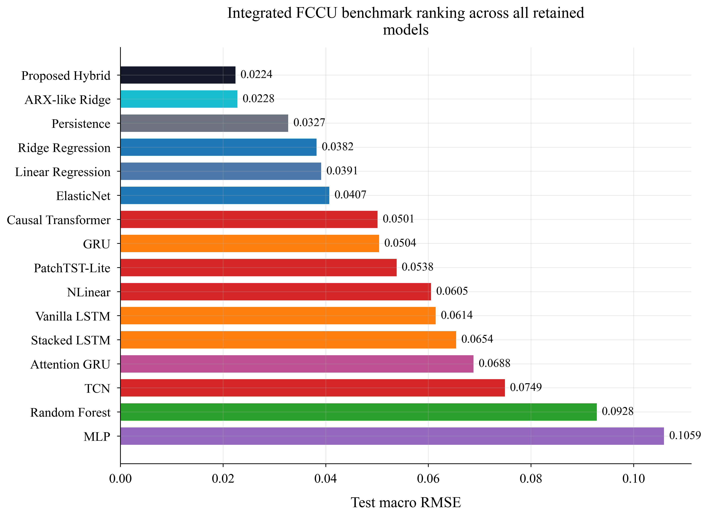
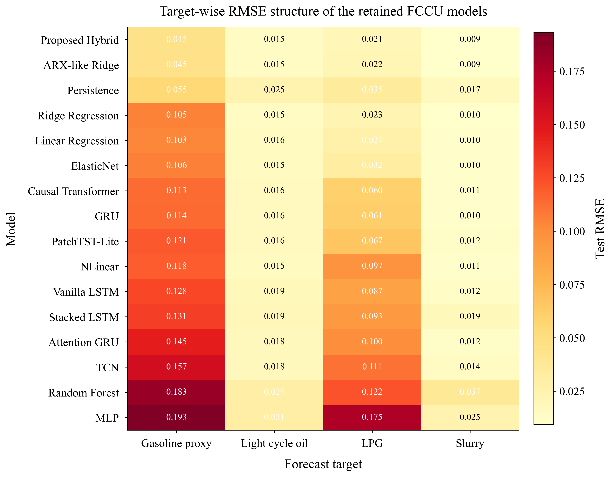
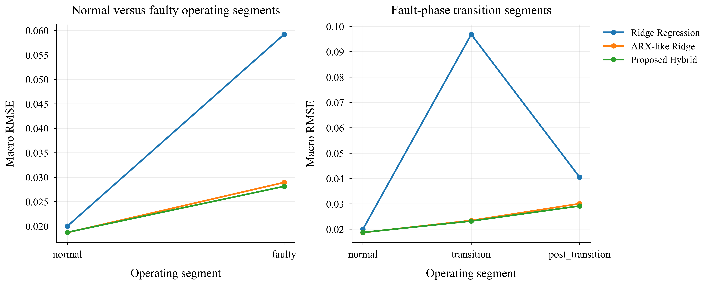
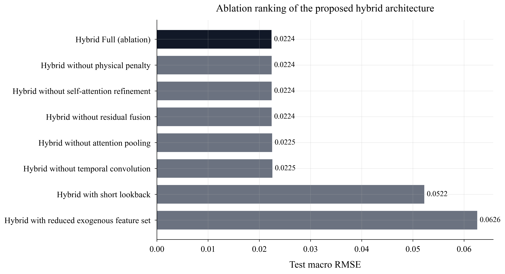
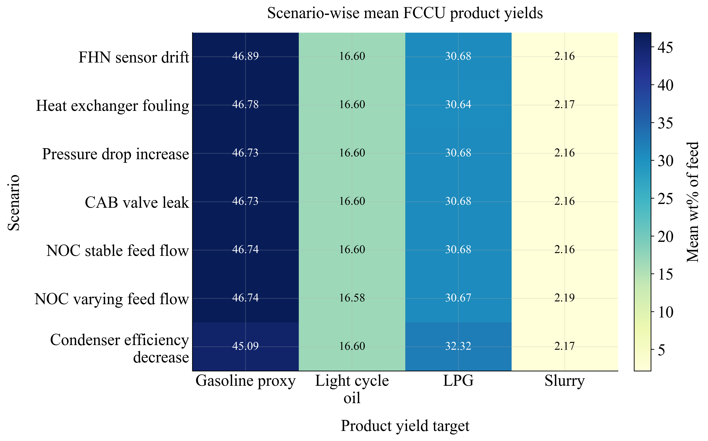
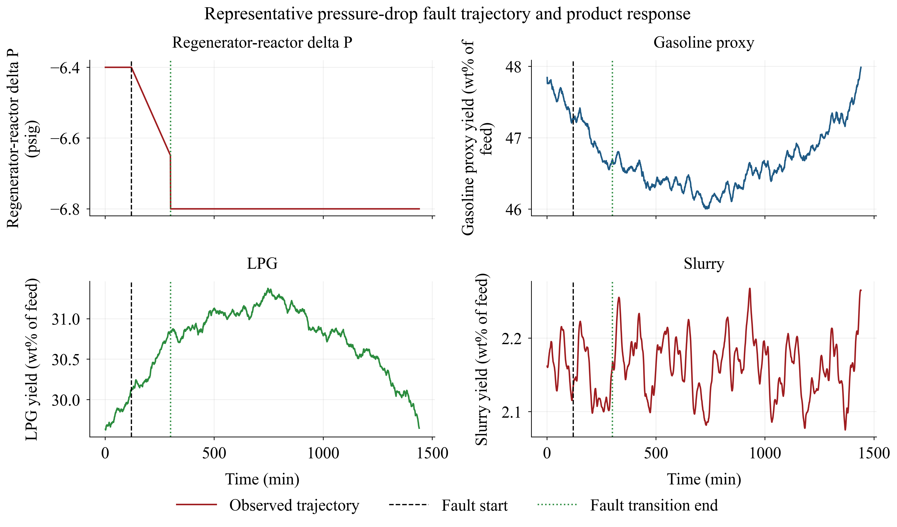

# FCCU Product-Yield Forecasting with Dynamic Data-Driven Models

This repository contains a reproducible research workflow for forecasting
product-yield proxies in a fluid catalytic cracking unit (FCCU) from
multivariate process time series. The work is organized as four executed
notebooks covering data audit, classical machine-learning baselines, recurrent
and modern sequence models, and an integrated manuscript-ready comparison.

The study uses the open ML-PSE FCCU benchmark as the empirical basis and
reframes it for short-horizon product-yield forecasting. The main contribution
is a hybrid dynamic model that combines an ARX-like linear skip branch with a
nonlinear causal sequence encoder, attention-based temporal aggregation,
residual correction, and an auxiliary total-yield consistency head.

## Research Scope

- Task: multi-output forecasting of FCCU product-yield proxies.
- Main dataset: `FCCU_DYNAMIC_NN_DATASET.csv`.
- Sampling interval: 1 minute.
- Dataset size: 20,160 rows and 75 columns.
- Scenarios: 7 retained operating scenarios, including normal operation and
  five fault cases.
- Split protocol: chronological train / validation / test splits inside each
  scenario.
- Forecast design: 30-step lookback and 5-step forecast horizon.
- Primary targets:
  - `gasoline_proxy_wt_pct_of_feed`
  - `light_cycle_oil_wt_pct_of_feed`
  - `lpg_wt_pct_of_feed`
  - `slurry_wt_pct_of_feed`
- Auxiliary target: `measured_products_wt_pct_of_feed`.

## Repository Workflow

| Notebook | Role |
| --- | --- |
| `FCCU_01_Data_Audit_and_Journal_Analysis.ipynb` | Data provenance, variable mapping, integrity audit, split checks, target statistics, feature-target diagnostics, and exploratory figures. |
| `FCCU_02_ML_Journal_Workflow.ipynb` | Leakage-aware preprocessing and classical ML baselines, including persistence, linear models, regularized regression, MLP, random forest, and ARX-like Ridge. |
| `FCCU_03_DL_SOTA_Proposed_Journal_Workflow.ipynb` | Recurrent, causal sequence, SOTA-inspired baselines, proposed hybrid model, ablation studies, robustness checks, and interpretability analysis. |
| `FCCU_04_Integrated_Results_Journal_Workflow.ipynb` | Consolidated model ranking, deduplicated comparison tables, shortlist results, operational diagnostics, and manuscript-ready closing statements. |

## Data Foundation

The working dataset is derived from the ML-PSE Fluid Catalytic Cracking Unit
dataset for process monitoring evaluation. The raw source files are scenario
CSV files with process measurements from an FCCU simulation benchmark. The
prepared project dataset adds readable column names, scenario metadata,
chronological split labels, operating phase labels, product-flow variables, and
yield proxies in `wt% of feed`.

The open source benchmark does not directly provide catalyst activity, feed API
gravity, sulfur content, direct coke yield, or direct dry-gas yield. Therefore,
this study uses the closest available measured product proxies:

| Product concept | Dataset target used |
| --- | --- |
| Gasoline yield | `gasoline_proxy_wt_pct_of_feed`, defined from light plus heavy naphtha proxy components |
| Light gas oil yield | `light_cycle_oil_wt_pct_of_feed` |
| LPG / gas-related yield proxy | `lpg_wt_pct_of_feed` |
| Heavy residual product proxy | `slurry_wt_pct_of_feed` |

The audit confirmed no duplicate rows, no missing feature values, no missing
target values, monotonic time ordering inside scenarios, and chronological
split consistency.

## Method Summary

The workflow uses leakage-aware dynamic modeling:

- Scenario-wise chronological ordering is preserved.
- Feature imputation and scaling are fitted on training data only.
- Fault-timing metadata are retained for analysis but excluded from model
  inputs.
- Each supervised sample is a causal window of past process states and, for
  autoregressive models, past target values.
- Evaluation reports RMSE, MAE, R2, MAPE, and SMAPE on validation and test
  splits.

The proposed hybrid architecture uses:

- Frozen ARX-like linear skip branch over the full input window.
- Causal temporal convolution for local transient extraction.
- GRU memory encoder for process dynamics.
- Causal self-attention refinement and temporal attention pooling.
- Residual nonlinear correction head.
- Context summary and residual gating branch.
- Auxiliary total-yield head for consistency supervision.


## Key Results

The integrated retained comparison covers 16 unique models from the ML and DL
workflows. The proposed hybrid model achieved the strongest aggregate test
score, while ARX-like Ridge remained the closest competitor.

| Rank | Model | Family | Input set | Test RMSE | Test MAE | Test R2 |
| ---: | --- | --- | --- | ---: | ---: | ---: |
| 1 | Proposed Hybrid | Proposed hybrid | Autoregressive + exogenous | 0.0224 | 0.0172 | 0.9679 |
| 2 | ARX-like Ridge | ARX-like reference | Autoregressive + exogenous | 0.0228 | 0.0174 | 0.9678 |
| 3 | Persistence | Naive | Target history only | 0.0327 | 0.0262 | 0.9055 |
| 4 | Ridge Regression | Regularized linear | Exogenous only | 0.0382 | 0.0250 | 0.9642 |
| 5 | Linear Regression | Linear | Exogenous only | 0.0391 | 0.0255 | 0.9596 |
| 6 | ElasticNet | Regularized linear | Exogenous only | 0.0407 | 0.0263 | 0.9637 |
| 7 | Causal Transformer | Modern sequence DL | Autoregressive + exogenous | 0.0501 | 0.0362 | 0.9551 |

Relative to the strongest exogenous-only baseline, Ridge Regression, the
proposed hybrid reduced test macro RMSE by 41.36%. Relative to ARX-like Ridge,
the reduction was 1.75%, which indicates that the FCCU forecasting task is
strongly shaped by linear dynamic structure as well as nonlinear residual
effects.



## Target-Wise Performance

The target-wise RMSE structure shows that the largest remaining errors are
associated with the gasoline proxy and LPG targets, while light cycle oil and
slurry yield proxies are forecast with smaller absolute RMSE.



Shortlisted target-wise RMSE:

| Model | Gasoline proxy | Light cycle oil | LPG | Slurry |
| --- | ---: | ---: | ---: | ---: |
| Proposed Hybrid | 0.0450 | 0.0146 | 0.0207 | 0.0093 |
| ARX-like Ridge | 0.0453 | 0.0146 | 0.0218 | 0.0094 |
| Ridge Regression | 0.1053 | 0.0147 | 0.0233 | 0.0096 |
| Causal Transformer | 0.1134 | 0.0163 | 0.0600 | 0.0108 |

## Operating-Segment Diagnostics

Operational diagnostics separate normal and faulty conditions, as well as
fault-transition segments. These results show that the proposed hybrid and
ARX-like Ridge are considerably more stable than exogenous-only Ridge during
fault-related operating segments.



## Ablation and Robustness Findings

The ablation study supports the full model design. Removing individual neural
components causes only small changes near the optimum, but reducing the
exogenous feature set or shortening the lookback window sharply degrades
performance. The best retained configuration uses a 30-step lookback and
5-step forecast horizon.



Robustness checks show mild degradation under small additive noise and larger
degradation under random missingness, which is expected for multivariate
dynamic models using dense process-state windows.

| Robustness setting | Test RMSE | Test MAE | Test R2 |
| --- | ---: | ---: | ---: |
| Additive noise 0.00 | 0.0224 | 0.0172 | 0.9679 |
| Additive noise 0.01 | 0.0238 | 0.0185 | 0.9672 |
| Additive noise 0.05 | 0.0408 | 0.0324 | 0.9523 |
| Random missingness 0.05 | 0.0950 | 0.0680 | 0.8273 |
| Random missingness 0.10 | 0.1346 | 0.0964 | 0.6982 |

## Exploratory Evidence

The data-audit notebook includes scenario-level product-yield structure,
feature-target association matrices, temporal autocorrelation diagnostics,
representative fault trajectories, and SHAP-based exploratory interpretation.





## Reproducibility

Recommended execution order:

```bash
python -m pip install -r requirements.txt
jupyter lab FCCU_01_Data_Audit_and_Journal_Analysis.ipynb
jupyter lab FCCU_02_ML_Journal_Workflow.ipynb
jupyter lab FCCU_03_DL_SOTA_Proposed_Journal_Workflow.ipynb
jupyter lab FCCU_04_Integrated_Results_Journal_Workflow.ipynb
```

Core Python dependencies used by the executed notebooks:

```text
numpy
pandas
scikit-learn
statsmodels
matplotlib
seaborn
torch
optuna
shap
tqdm
nbformat
jupyterlab
```

The executed environment recorded in the notebooks used Python 3.11.14,
NumPy 2.4.4, pandas 2.3.3, scikit-learn 1.8.0, matplotlib 3.10.8, and
PyTorch 2.10.0. The deep-learning workflow selected the Apple Silicon MPS
backend when available.

## Project Files

```text
.
|-- FCCU_01_Data_Audit_and_Journal_Analysis.ipynb
|-- FCCU_02_ML_Journal_Workflow.ipynb
|-- FCCU_03_DL_SOTA_Proposed_Journal_Workflow.ipynb
|-- FCCU_04_Integrated_Results_Journal_Workflow.ipynb
|-- FCCU_DYNAMIC_NN_DATASET.csv
|-- DATASET_CONTEXT/
|-- DOCs/
`-- artifacts/
```

## Provenance

Primary dataset source:

- ML-PSE FCCU dataset page: https://mlforpse.com/fccu-dataset/
- ML-PSE FCCU GitHub repository: https://github.com/ML-PSE/Fluid-Catalytic-Cracking-Unit-Dataset-for-Process-Monitoring-Evaluation

The prepared dataset and notebooks in this repository are research artifacts
for product-yield forecasting. Proxy targets should be interpreted according
to the available measured variables in the open FCCU benchmark rather than as
direct refinery laboratory assays.
